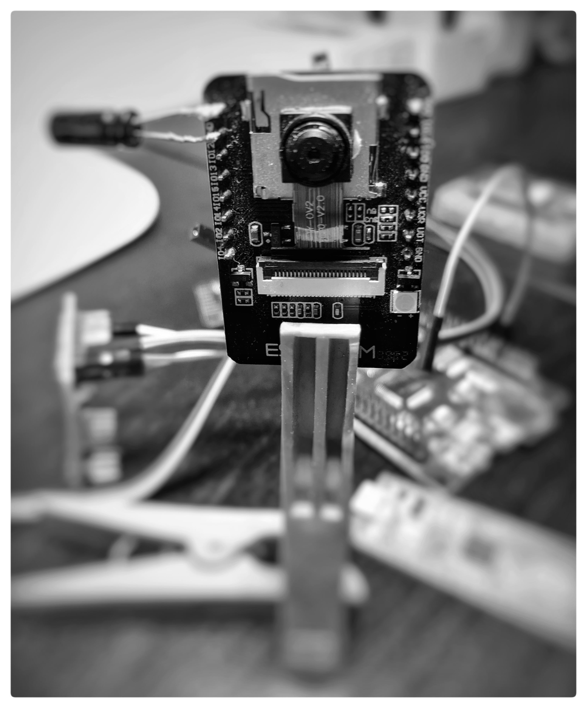

# esp32-cam-micropython-2022




It was three years ago. I started playing with MicroPython with camera support on an ESP32-Camera board with MicroPython version 1.11-XXX.


This time, the firmware support version 1.18-XXX. We may reach version 2.00-XXX by the end of 2022. The MicroPython team has been busy.


The build process and structure have changed since version 1.11-XXX.


This firmware is made especially for the ESP32-Camera board and was cleanly compiled with Espressif IDF version 4.4. It supports the OV2640 camera and PSRAM. To reduce size, webrepl, BLE, help modules were not included in the firmware.


I wish to reach a wider audience. So, I will try to make this as simple as possible. To join the fun, these are what you need to do:

 1. Download MicroPython firmware file firmware.bin
 2. Download script files help.py,  html.py,  site.py,  webcam.py, and  wifi.py
 3. Flash the firmware.bin to your ESP32-Camera board
 4. Save the five script files onto the flash file system of your ESP32-Camera board.
 5. Install *thonny* Python IDE from https://thonny.org

The *thonny* IDE helps beginners flash new firmware and upload script files to a development board.


To flash a new MicroPython firmware, these are what you need to:

 1. Connect GPIO-00 and GND pins. 
 2. Connect your ESP32-Camera board to an FTDI USB UART adapter. Remember to cross TX and RX wires between the board and adapter.
 3. Connect the FTDI adapter to a USB port of your PC.
 4. Start *thonny* IDE
 5. Click Tools --> Options --> Interpreter, choose MicroPython (ESP32). For Port, choose "Try to detect port automatically"
 6. Click the "Install or update firmware" link. Click Reload and choose Port value, for example /dev/ttyUSB0". Click [Browse...] and choose the firmware file. Click Install. Click Close when Done!
 7. Remove the wire between GPIO-00 and GND pins and push the RST button on the development board.

Hopefully, you will get MicroPython REPL in the thonny IDE shell window.


```python
MicroPython v1.18-610-gcf7d962cf-kaki5 on 2022-06-10; ESP32 CAMERA module (KAKI5) with ESP32

>>> 
```

We can test the camera module in the REPL

```python
>>> import camera

>>> camera.init()

True

>>> img=camera.capture()

>>> len(img)

58810

>>>
```


Congratulation. We now have a working MicroPython with the camera module.


We will now upload the five script files onto the flash file system using thonny IDE. Click [Open...] to load each script file into the IDE. You should have all five files in different TAB windows. You need to edit the 'wifi.py' file. Change the "YOUR-SSID" and "YOUR-PWD" to the values of your home WiFi.

Save all the five files to "MicroPython device". Do this for each script file. Click File --> Save as... and choose MicroPython device as destination. Make sure to write the correct file name.


We can check whether all five files are in the flash storage using the REPL.


```python
>>> uos.listdir()

['boot.py', 'help.py', 'html.py', 'site.py', 'webcam.py', 'wifi.py']

>>>
```


We are now ready to try our webcam server. In the REPL:

```python
>>> execfile('webcam.py')

Camera ready?:  True

Camera ready

Waiting ...

Waiting ...

Connected to dlink-3530

network config: ('10.0.0.46', '255.255.255.0', '10.0.0.138', '148.122.164.253')

PWD: M1XDYKh3

Start server 80

Try - http://10.0.0.46/login/M1XDYKh3
```


Your output will differ from what is shown here. Open a browser and go to the login URL. You will get "OK!" if successful. Now, go to the 'root' page, for example, http://10.0.0.46. You will receive a 'help' page.


Once login, the server is locked to the IP of the PC. Requests from other PCs are not allowed. To remove the lock, you need to logout, for example, http://10.0.0.46/logout. The server will create a new random login password. You will see the new password in the REPL.


```python
('10.0.0.72', 37146) ['GET', '/logout']

New PWD: IT0XfQOQ
```


You need to use the new password to login again. You can disable the authentication scheme by 'auth.on=False' in webcam.py.


After login, you can try:

 1. Rotate the image in the browser. http://10.0.0.46/rot/90
 2. Take a photo and show it in the browser. http://10.0.0.46/snap
 3. Live streaming to the browser. http://10.0.0.46/webcam
 4. Get help page. http://10.0.0.46

Please change the IP to your server IP. For more information, please read the help page.


You can now live stream video from your ESP32-Camera board at your front gate.

You can also do other projects with your ESP32-Camera board now that you have camera-enabled MicroPython firmware. 

Good luck.

